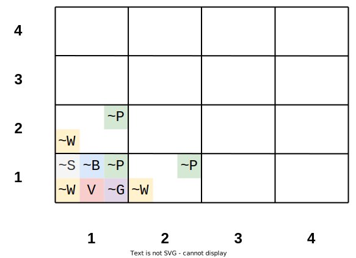
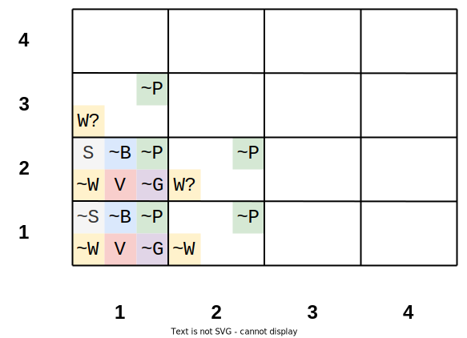
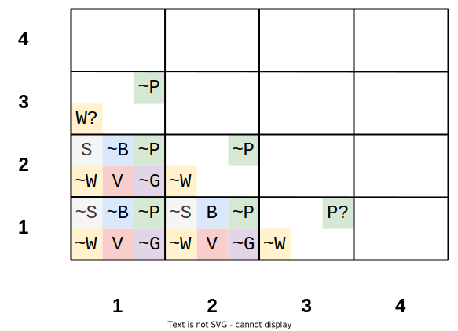
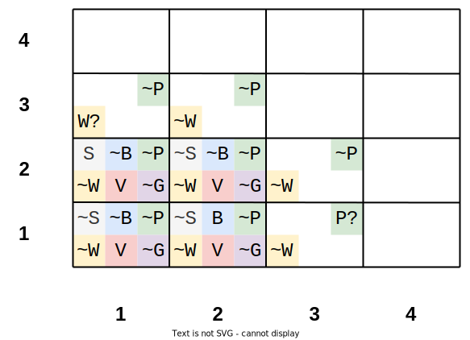

# Wumpus World

Wumpus World example solved in python using Matrices and First Order Logic.

The Wumpus world is a simple world example to illustrate the worth of a knowledge-based agent and to represent knowledge representation.


## Rules

There are also some components which can help the agent to navigate the cave. These components are given as follows:

* The rooms adjacent to the **Wumpus** room are smelly, so that it would have some **stench**.
* The room adjacent to **Pits** has a **breeze**, so if the agent reaches near to PIT, then he will perceive the **breeze**.
* There will be **glitter** in the room if and only if the room has **gold**.
* The **Wumpus** can be killed by the agent if the agent is facing to it, and **Wumpus** will emit a horrible scream which can be heard anywhere in the cave.

## PEAS description of Wumpus world:

To explain the Wumpus world we have given PEAS description as below:

### Performance measure:

* +1000 reward points if the agent comes out of the cave with the gold.
* -1000 points penalty for being eaten by the Wumpus or falling into the pit.
* -1 for each action, and -10 for using an arrow.
* The game ends if either agent dies or came out of the cave.

### Environment:

* A 4*4 grid of rooms.
* The agent initially in room square [1, 1], facing toward the right.
* Location of Wumpus and gold are chosen randomly except the first square [1,1].
* Each square of the cave can be a pit with probability 0.2 except the first square.

### Actuators:

* Left turn,
* Right turn
* Move forward
* Grab
* Release
* Shoot.

### Sensors:

* The agent will perceive the stench if he is in the room adjacent to the Wumpus. (Not diagonally).
* The agent will perceive breeze if he is in the room directly adjacent to the Pit.
* The agent will perceive the glitter in the room where the gold is present.
* The agent will perceive the bump if he walks into a wall.
* When the Wumpus is shot, it emits a horrible scream which can be perceived anywhere in the cave.
* These percepts can be represented as five element list, in which we will have different indicators for each sensor.
* Example if agent perceives stench, breeze, but no glitter, no bump, and no scream then it can be represented as:
[Stench, Breeze, None, None, None].

## The Wumpus world Properties:
* Partially observable: The Wumpus world is partially observable because the agent can only perceive the close environment such as an adjacent room.
* Deterministic: It is deterministic, as the result and outcome of the world are already known.
* Sequential: The order is important, so it is sequential.
* Static: It is static as Wumpus and Pits are not moving.
* Discrete: The environment is discrete.
* One agent: The environment is a single agent as we have one agent only and Wumpus is not considered as an agent.

## Atomic propositions:

* Let `Pij` be true if there is a **Pit** in the room `[i, j]`.
* Let `Bij` be true if agent perceives **breeze** in `[i, j]`, (dead or alive).
* Let `Wij` be true if there is **wumpus** in the square`[i, j]`.
* Let `Sij` be true if agent perceives **stench** in the square `[i, j]`.
* Let `Vij` be true if the square `[i, j]` has been visited.
* Let `Gij` be true if there is **gold** (and glitter) in the square `[i, j]`.
<!--* Let `OKij` be true if the room is safe.-->

Where `i` represents the row and `j` the column.

## Exploring

I am going to explore two solutions, the first one storing all the information inside a Matrix (called `M`), the second one using First Order Logic.


We are going to need a variable called `path` to store the path we take to find the gold

```
path = []
```

And also a function called `neighbors` which returns the neighbors of a block located at `[row, col]`

```
function neighbors (row, col):
    results = []
    if row + 1 < 4:
        results append [row+1, col]
    if row - 1 > 0:
        results append [row-1, col]
    if col + 1 < 4:
        results append [row, col+1]
    if col - 1 > 0:
        results append [row, col-1]
    return results
```

Now we are ready to find a solution:

### At Time 0
---

At time 0, the agent is at `[1,1]`

```
path = [
    [1,1]
]
```

1. Matrix based Knoledge Base

```
M[1,1] = [~S, ~B, ~P, ~W, V, ~G]

for each neighbor in neighbors: # [2,1], [1,2]
    if S in actual and ~W not in neighbor:
        M[neighbor] append W?
    else:
        M[neighbor] append ~W
    
    if B in actual and ~P not in neighbor:
        M[neighbor] append P?
    else:
        M[neighbor] append ~P
```

Our kb matrix should looks like:




2. FOL based Knoledge Base

```
~S11, ~B11, ~P11, ~W11, V11, ~G11

~S11 => (~W12 & ~W21)

~B11 => (~P12 & ~P21)
```

`neighbors (1,1) = [2,1], [1,2]`

```
for each neighbor in neighbors: # [2,1], [1,2]
    if ~W in neighbor and ~P in neighbor and V not in neighbor:
        agent moves to neighbor
```

Our agent choose go to `[2,1]`

### At Time 1
---

At time 0, the agent is at `[2,1]`

```
path = [
    [1,1], [2,1]
]
```

1. Matrix based Knoledge Base

```
M[2,1] = [S, ~B, ~P, ~W, V, ~G]


for each neighbor in neighbors: # [3,1], [1,1], [2,2]
    if S in actual and ~W not in neighbor:
        M[neighbor] append W?
    else:
        M[neighbor] append ~W
    
    if B in actual and ~P not in neighbor:
        M[neighbor] append P?
    else:
        M[neighbor] append ~P
```

Our kb matrix should looks like:




2. FOL based Knoledge Base

```
S21, ~B21, ~P21, ~W21, V21, ~G21

S21 => (W31 | W11 | W22)

~B21 => (~P31 & ~P11 & ~P22)
```

`neighbors (2,1) = [3,1], [1,1], [2,2]`

```
for each neighbor in neighbors: # [3,1], [1,1], [2,2]
    if ~W in neighbor and ~P in neighbor and V not in neighbor:
        agent moves to neighbor
```

* Our agent can't move to [3,1] because we don't know if Wumpus is there `W?`.
* Our agent can't move to [1,1] because the block was already visited `V`.
* Our agent can't move to [2,2] because we don't know if Wumpus is there `W?`.

So, we return to the previous position in path `[1,1]`

### At Time 2
---

At time 2, the agent is at `[1,1]`

```
path = [
    [1,1]
]
```

1. Matrix based Knoledge Base

```
M[2,1] = [S, ~B, ~P, ~W, V, ~G]


for each neighbor in neighbors: # [2,1], [1,2]
    if S in actual and ~W not in neighbor:
        M[neighbor] append W?
    else:
        M[neighbor] append ~W
    
    if B in actual and ~P not in neighbor:
        M[neighbor] append P?
    else:
        M[neighbor] append ~P
```

Our kb matrix should looks like:


2. FOL based Knoledge Base

```
S21, ~B21, ~P21, ~W21, V21, ~G21

S21 => (W31 | W11 | W22)

~B21 => (~P31 & ~P11 & ~P22)
```

`neighbors (2,1) = [2,1], [1,2]`

```
for each neighbor in neighbors: # [2,1], [1,2]
    if ~W in neighbor and ~P in neighbor and V not in neighbor:
        agent moves to neighbor
```

* Our agent can't move to [2,1] because the block was already visited `V`.

Our agent choose go to `[1,2]`

### At Time 3
---

At time 3, the agent is at `[1,2]`

```
path = [
    [1,1], [1,2]
]
```

1. Matrix based Knoledge Base

```
M[1,2] = [~S, B, ~P, ~W, V, ~G]


for each neighbor in neighbors: # [2,2], [1,3], [1,1]
    if S in actual and ~W not in neighbor:
        M[neighbor] append W?
    else:
        M[neighbor] append ~W
    
    if B in actual and ~P not in neighbor:
        M[neighbor] append P?
    else:
        M[neighbor] append ~P
```

Our kb matrix should looks like:




2. FOL based Knoledge Base

```
~S12, B12, ~P12, ~W12, V12, ~G12

~S12 => (~W22 & ~W13 & ~W11)

B12 => (P22 | P13 | P11)


```

`neighbors (2,1) = [2,2], [1,3], [1,1]`

```
for each neighbor in neighbors: # [2,2], [1,3], [1,1]
    if ~W in neighbor and ~P in neighbor and V not in neighbor:
        agent moves to neighbor
```

Our agent choose go to `[2,2]`

### At Time 4
---

At time 3, the agent is at `[2,2]`

```
path = [
    [1,1], [1,2], [2,2]
]
```

1. Matrix based Knoledge Base

```
M[2,2] = [~S, ~B, ~P, ~W, V, ~G]


for each neighbor in neighbors: # [3,2], [1,2], [2,3], [2,1]
    if S in actual and ~W not in neighbor:
        M[neighbor] append W?
    else:
        M[neighbor] append ~W
    
    if B in actual and ~P not in neighbor:
        M[neighbor] append P?
    else:
        M[neighbor] append ~P
```

Our kb matrix should looks like:




2. FOL based Knoledge Base

```
~S22, ~B22, ~P22, ~W22, V22, ~G22

~S22 => (~W32 & ~W12 & ~W23 & ~W21)

~B22 => (~P32 & ~P12 & ~P23 & ~P21)

```

`neighbors (2,2) = [3,2], [1,2], [2,3], [2,1]`

```
for each neighbor in neighbors: # [3,2], [1,2], [2,3], [2,1]
    if ~W in neighbor and ~P in neighbor and V not in neighbor:
        agent moves to neighbor
```

Our agent choose go to `[3,2]`

to be continued...

## How to execute the solution

```
python src\Main.py
```

Output:

```
Agent is on: 1, 1
  ,  ,  ,  ,  ,  ,        ,  ,  ,  ,  ,  ,        ,  ,  ,  ,  ,  ,        ,  ,  ,  ,  ,  ,
  ,  ,  ,  ,  ,  ,        ,  ,  ,  ,  ,  ,        ,  ,  ,  ,  ,  ,        ,  ,  ,  ,  ,  ,
  ,  ,~P,~W,  ,  ,        ,  ,  ,  ,  ,  ,        ,  ,  ,  ,  ,  ,        ,  ,  ,  ,  ,  ,
~S,~B,~P,~W, V,~G,        ,  ,~P,~W,  ,  ,        ,  ,  ,  ,  ,  ,        ,  ,  ,  ,  ,  ,

Agent is on: 2, 1
  ,  ,  ,  ,  ,  ,        ,  ,  ,  ,  ,  ,        ,  ,  ,  ,  ,  ,        ,  ,  ,  ,  ,  ,
  ,  ,~P,W?,  ,  ,        ,  ,  ,  ,  ,  ,        ,  ,  ,  ,  ,  ,        ,  ,  ,  ,  ,  ,
 S,~B,~P,~W, V,~G,        ,  ,~P,W?,  ,  ,        ,  ,  ,  ,  ,  ,        ,  ,  ,  ,  ,  ,
~S,~B,~P,~W, V,~G,        ,  ,~P,~W,  ,  ,        ,  ,  ,  ,  ,  ,        ,  ,  ,  ,  ,  ,

Agent is on: 1, 1
  ,  ,  ,  ,  ,  ,        ,  ,  ,  ,  ,  ,        ,  ,  ,  ,  ,  ,        ,  ,  ,  ,  ,  ,
  ,  ,~P,W?,  ,  ,        ,  ,  ,  ,  ,  ,        ,  ,  ,  ,  ,  ,        ,  ,  ,  ,  ,  ,
 S,~B,~P,~W, V,~G,        ,  ,~P,W?,  ,  ,        ,  ,  ,  ,  ,  ,        ,  ,  ,  ,  ,  ,
~S,~B,~P,~W, V,~G,        ,  ,~P,~W,  ,  ,        ,  ,  ,  ,  ,  ,        ,  ,  ,  ,  ,  ,

Agent is on: 1, 2
  ,  ,  ,  ,  ,  ,        ,  ,  ,  ,  ,  ,        ,  ,  ,  ,  ,  ,        ,  ,  ,  ,  ,  ,
  ,  ,~P,W?,  ,  ,        ,  ,  ,  ,  ,  ,        ,  ,  ,  ,  ,  ,        ,  ,  ,  ,  ,  ,
 S,~B,~P,~W, V,~G,        ,  ,~P,~W,  ,  ,        ,  ,  ,  ,  ,  ,        ,  ,  ,  ,  ,  ,
~S,~B,~P,~W, V,~G,      ~S, B,~P,~W, V,~G,        ,  ,P?,~W,  ,  ,        ,  ,  ,  ,  ,  ,

Agent is on: 2, 2
  ,  ,  ,  ,  ,  ,        ,  ,  ,  ,  ,  ,        ,  ,  ,  ,  ,  ,        ,  ,  ,  ,  ,  ,
  ,  ,~P,W?,  ,  ,        ,  ,~P,~W,  ,  ,        ,  ,  ,  ,  ,  ,        ,  ,  ,  ,  ,  ,
 S,~B,~P,~W, V,~G,      ~S,~B,~P,~W, V,~G,        ,  ,~P,~W,  ,  ,        ,  ,  ,  ,  ,  ,
~S,~B,~P,~W, V,~G,      ~S, B,~P,~W, V,~G,        ,  ,P?,~W,  ,  ,        ,  ,  ,  ,  ,  ,

Agent is on: 3, 2
  ,  ,  ,  ,  ,  ,        ,  ,  ,  ,  ,  ,        ,  ,  ,  ,  ,  ,        ,  ,  ,  ,  ,  ,
  ,  ,~P,W?,  ,  ,       S, B,~P,~W, V, G,        ,  ,P?,W?,  ,  ,        ,  ,  ,  ,  ,  ,
 S,~B,~P,~W, V,~G,      ~S,~B,~P,~W, V,~G,        ,  ,~P,~W,  ,  ,        ,  ,  ,  ,  ,  ,
~S,~B,~P,~W, V,~G,      ~S, B,~P,~W, V,~G,        ,  ,P?,~W,  ,  ,        ,  ,  ,  ,  ,  ,

[[1, 1], [1, 1], [1, 2], [2, 2], [3, 2]]                
```